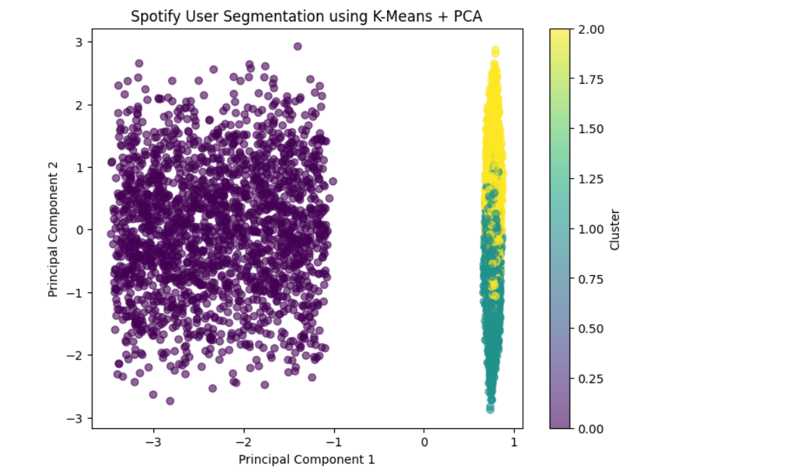
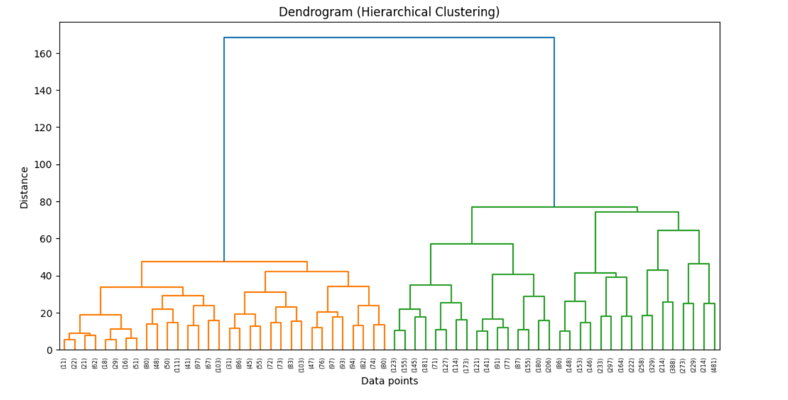

🎧 Spotify User Segmentation using Unsupervised Learning

```python
# High-level usage
# 1) Load data
# 2) Preprocess & scale
# 3) Run clustering and PCA
# 4) Visualize results


 Problem Statement

Understanding user listening behavior is critical for personalization, retention, and monetization.
This project applies multiple unsupervised learning techniques to identify meaningful user segments based on Spotify listening behavior.

 Dataset

Spotify user-level listening data containing behavioral attributes such as listening time, skip rate, ad exposure, and offline usage.

 Methodology

Feature selection focused on behavioral signals
Data scaling using StandardScaler
K-Means clustering for primary user segmentation
Elbow Method to select optimal number of clusters
PCA for dimensionality reduction and visualization
DBSCAN to identify anomalous listening patterns
Hierarchical clustering to validate multi-level cluster structure

 Models & Techniques Used

K-Means Clustering
Principal Component Analysis (PCA)
DBSCAN
Agglomerative Hierarchical Clustering

 Key Results

Identified three primary user personas using K-Means
PCA visualization showed clear behavioral separation
DBSCAN revealed a dominant mainstream cluster and significant irregular users
Hierarchical clustering confirmed the presence of two major behavioral families

## Visualizations

### K-Means + PCA


### Dendrogram



##  Results Summary

- Optimal K determined (Elbow): **3 clusters**
- PCA explained variance (PC1+PC2): **48%**
- DBSCAN found:
  - 1 main cluster with 5982 users
  - ~1910 noise users
  - Several small behavior clusters
- Hierarchical confirmed 2 major behavior groups


 Key Insights

User behavior is better segmented by listening patterns than demographics
Premium users exhibit distinct sub-behaviors (loyal vs exploratory)
Density-based methods are effective for anomaly detection but not persona creation

🛠 Tech Stack

Python
Pandas, NumPy
Scikit-learn
SciPy
Matplotlib

 Conclusion

This project demonstrates how different unsupervised learning techniques complement each other.
K-Means provides actionable personas, PCA enables interpretability, DBSCAN identifies outliers,
and hierarchical clustering validates structural consistency.
